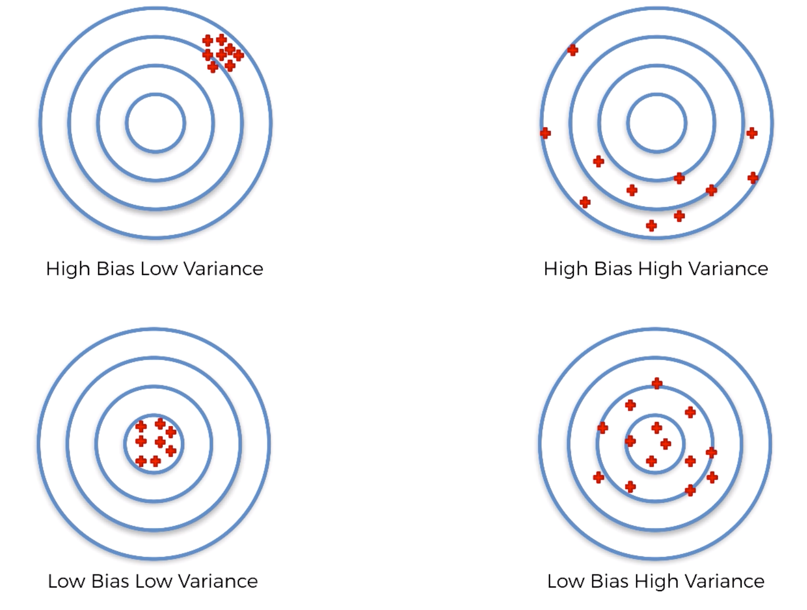

# Part 10: Model Selection & Boosting

This part will cover these topics: 
* How to deal with the bias variance tradeoff when building a model and evaluating its performance
* How to choose the optimal values for the hyperparameters (the parameters that are not learned)
* How to find the most appropriate Machine Learning model for my business problem
* What is bias variance tradeoff? What is hyperparameter?

## Section 38: Model Selection

Judging model perfomance only on one accuracy and on one test set is not quite relevant.
That’s why we need Cross Validation technic.

**Cross Validation** is when you split test set into n pieces and test your model metrics n times, so the final metrics are average ones which are more accurate.

**Bias-Variance Tradeoff:** 

```
from sklearn.model_selection import cross_val_score

accuracies = cross_val_score(estimator=classifier, X=X_train, y=y_train, cv=10)
accuracies.mean()
```

Every ML model is composed of two types of parameters. The first type of parameters are the parameters which are learned through the machine learning algorithm and the second type of parameters are paremeters we choose. Like kernel in SVM model or penalty parameter.

Here are two queastion which will help to choose the best model for a given problem:
* Is it is a regression, classification or clustering problem?
* Is it linear or non linear problem?

The last question sometimes is not easy to answer, especially in case of a large dataset. This question can be answered by using Grid Search technic.

```
from sklearn.model_selection import GridSearchCv

# we list all parameters can differ for the model we used
parameters = [
    {
        ‘C’: [1, 10, 100, 1000],
        ‘kernel’: [‘linear’]
    },
    {
        ‘C’: [1, 10, 100, 1000],
        ‘kernel’: [‘rbf’]
        ‘gamma’: [0.5, 0.1, 0.01, 0.001]
    },
]
# and then grid search runs trains the model multiple times with all combinations of parameters described in the list
grid_search = GridSearchCV(estimator=classifier, param_grid=parameters, scoring=‘accuracy’, cv=10)
grid_search = grid_search.fit(X_train, y_train)
best_accuracy = grid_search.best_score_
best_parameters = grid_search.best_params_
```

## Section 39: XGBoost
Nowadays XGBoost is one of the best algorithms in terms of speed of training and accuracy of the result model. It doesn’t require feature scaling that make it even better.
Unfortunately the lecturer didn’t tell or show much about it

```python
from xgboost import XGBClassifier

classifier = XGBClassifier()
classifier.fit(X_train, y_train)
```
