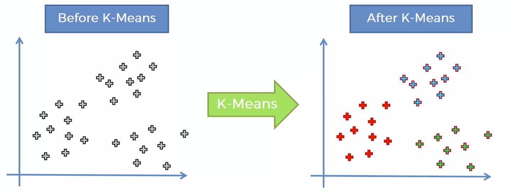
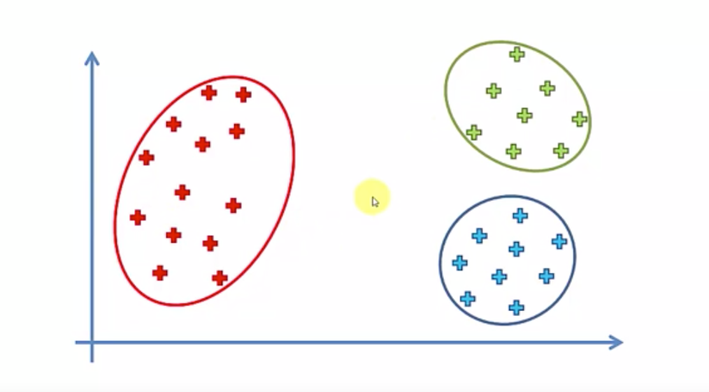
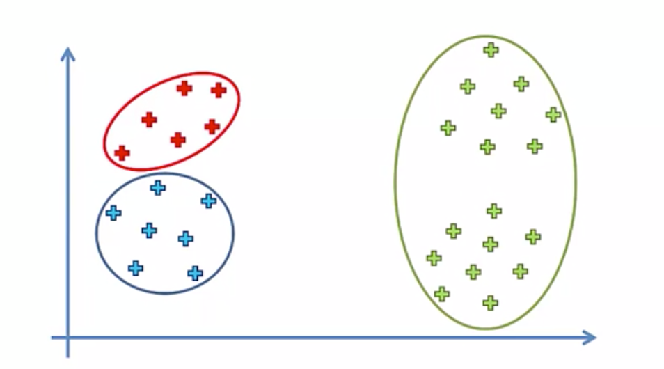
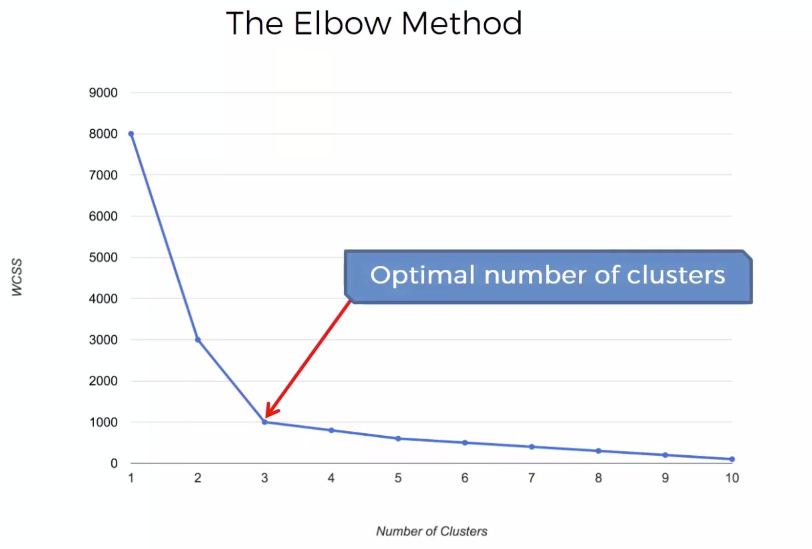
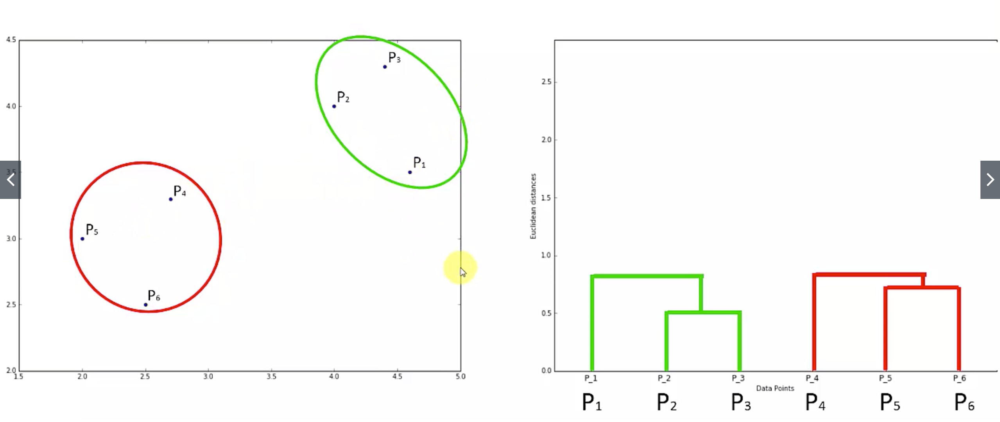
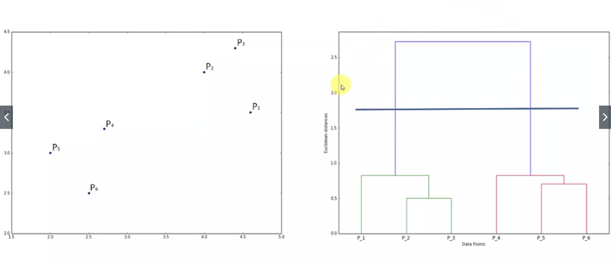
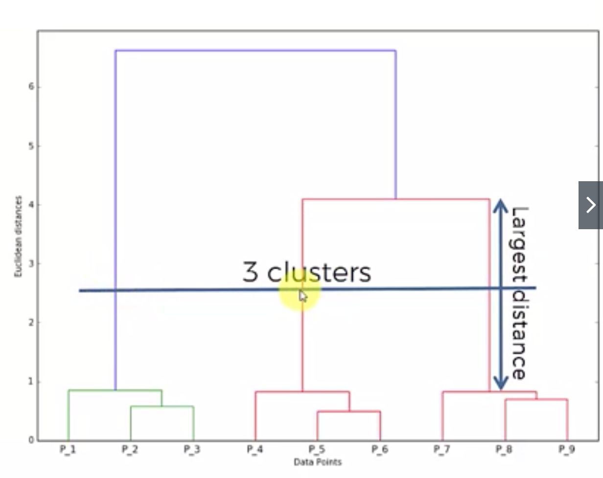
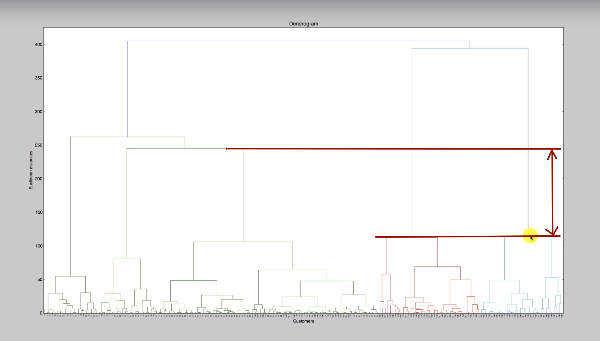

# Part 4: Clustering

**Clustering** is similar to classification, but the basis is different. In Clustering you don’t know what you are looking for, and you are trying to identify some segments or clusters in your data. When you use clustering algorithms on your dataset, unexpected things can suddenly pop up like structures, clusters and groupings you would have never thought of otherwise.

## Section 21: K-Means Clustering

That’s how it works:
* Step 1. Choose the number K of clusters 
* Step 2. Select random points which will be controids of clusters (not necessarily from the dataset)
* Step 3. Assign each data point to the closest centroid. That forms K clusters
* Step 4. Compute and place new controids for all clusters
* Step 5. If there are no reassignments, the model is done. Otherwise, repeat steps 3 and 4.

The algorythm has a tricky thing you should be aware of - random initialization trap. Sometimes random centroids can be placed in unlucke places which can lead to not quite accureate results
Expected result: 
Actual result: 
That’s why there is updated model K-Means++. Description of this model and the way it choose initial centroids is out of the scope of the course, but what we need to know is that all libraries (sklearn in our case) already use it.

Choosing the right number of clusters
WCSS stands for … and it is sum of squared sums of distances between all points and a centroid for every cluster. The more clusters you have the smaller the value will become. You have to create a chart and find optimal numer of clasters. It is called The Elbow Method: 

```
# Importing the libraries
import numpy as np
import matplotlib.pyplot as plt
import pandas as pd

# importing the mall data-set
dataset = pd.read_csv('../data_files/Mall_customers.csv')
X = dataset.iloc[:, [3, 4]].values

# Using the Elbow method to find the optimal number of clusters
from sklearn.cluster import KMeans

wcss = []
for i in range(1, 11):
    kmeans = KMeans(n_clusters=i, init='k-means++', max_iter=300, n_init=10, random_state=0)
    kmeans.fit(X)
    wcss.append(kmeans.inertia_)

plt.plot(range(1, 11), wcss)
plt.title('The Elbow Method')
plt.xlabel('Number of clusters')
plt.ylabel('WCSS')
plt.show()

# Applying k-means to the mall dataset
kmeans = KMeans(n_clusters=5, init='k-means++', max_iter=300, n_init=10, random_state=0)
y_kmeans = kmeans.fit_predict(X)

# Visulizing the clusters
plt.scatter(X[y_kmeans==0, 0], X[y_kmeans==0, 1], s=100, c='red', label='Cluster 1')
plt.scatter(X[y_kmeans==1, 0], X[y_kmeans==1, 1], s=100, c='blue', label='Cluster 2')
plt.scatter(X[y_kmeans==2, 0], X[y_kmeans==2, 1], s=100, c='green', label='Cluster 3')
plt.scatter(X[y_kmeans==3, 0], X[y_kmeans==3, 1], s=100, c='cyan', label='Cluster 4')
plt.scatter(X[y_kmeans==4, 0], X[y_kmeans==4, 1], s=100, c='magenta', label='Cluster 5')

plt.scatter(kmeans.cluster_centers_[:, 0], kmeans.cluster_centers_[:, 1], s=300, c='yellow', label='Centroids')
plt.title('Clusters of clients')
plt.xlabel('Annual Income (k$)')
plt.ylabel('Spending Score (1-100)')
plt.legend()
plt.show()
```

## Section 22: Hierarchical Clustering

There are two types of HIerarchical Clustering: Agglomerative and Divisive.
Agglomerative HC:
* Step 1. Make each data point a single-point cluster. That forms N clusters.
* Step 2. Take the two closest data points(clusters) and make them a single cluster. That forms N-1 clusters
closest clusters are 
* Step 3. Repeat step 2 until there is only one cluster left

Divisive HC is the same thing but with reversed steps.

How Dendrograms Work.
Dendogram is kind of memory for a HC algorythm. It remembers every step of the algorythm. It contains distances between two merged clusters for every step. The bigger distance, the bigger dissimilarity of features of clusters: 

There is no the only correct way to use dendrograms.
We can set maximum level of dissimilarity, which will decline N last merges and leave multiple clusters as the result: 
Standard approach is to look for the highest vertical distance which doesn’t cross extended horizontal lines and revoke related merges: 

Here is example of a largest distance which doesn’t cross any horizontal line: 

To determine the cutting section, various methods can be used. The first method, empirically, this method should be based on knowledge of researcher. For example, the existing cluster based on appearance differences, can be divided into three or four groups.

The second method uses a statistical conventions. The dendrogram can be cut where the difference is most significant. Another technique is to use the square root of the number of individuals. Another technique is to use at least 70% of the distance between the two groups. The next method is to use the function discrimination and classification based on discrimination function.

Implementation
```
# Importing libraries
import numpy as np
import matplotlib.pyplot as plt
import pandas as pd

# Importing the mall dataset
dataset = pd.read_csv('../../data_files/Mall_Customers.csv')
X = dataset.iloc[:, [3, 4]].values

# Using the dendogram to find the optimal number of clusters
import scipy.cluster.hierarchy as sch
dendrogram = sch.dendrogram(sch.linkage(X, method='ward'))
plt.title('Dendogram')
plt.xlabel('Customers')
plt.ylabel('Euclidean distances')
plt.show()

# Fitting hierarchical clustering to the mall dataset
from sklearn.cluster import AgglomerativeClustering
hc = AgglomerativeClustering(n_clusters=5, affinity='euclidean', linkage='ward')
y_hc = hc.fit_predict(X)

# Visualizing the clusters
plt.scatter(X[y_hc==0, 0], X[y_hc==0, 1], s=100, c='red', label='Cluster 1')
plt.scatter(X[y_hc==1, 0], X[y_hc==1, 1], s=100, c='blue', label='Cluster 2')
plt.scatter(X[y_hc==2, 0], X[y_hc==2, 1], s=100, c='green', label='Cluster 3')
plt.scatter(X[y_hc==3, 0], X[y_hc==3, 1], s=100, c='cyan', label='Cluster 4')
plt.scatter(X[y_hc==4, 0], X[y_hc==4, 1], s=100, c='magenta', label='Cluster 5')

plt.title('Clusters of clients')
plt.xlabel('Annual Income (k$)')
plt.ylabel('Spending Score (1-100)')
plt.legend()
plt.show()

```

Pros and cons of two clustering algorythms: [link](https://sds-platform-private.s3-us-east-2.amazonaws.com/uploads/P14-Clustering-Pros-Cons.pdf)


