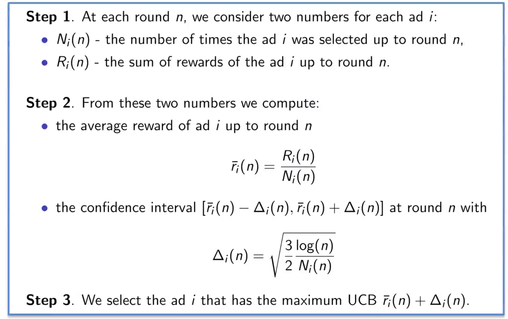
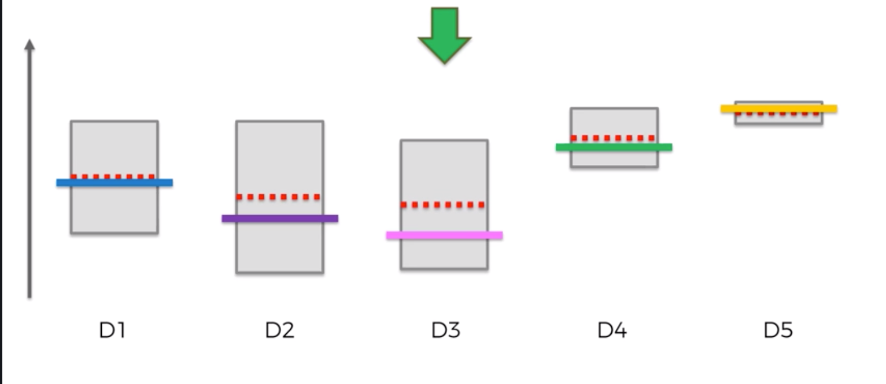
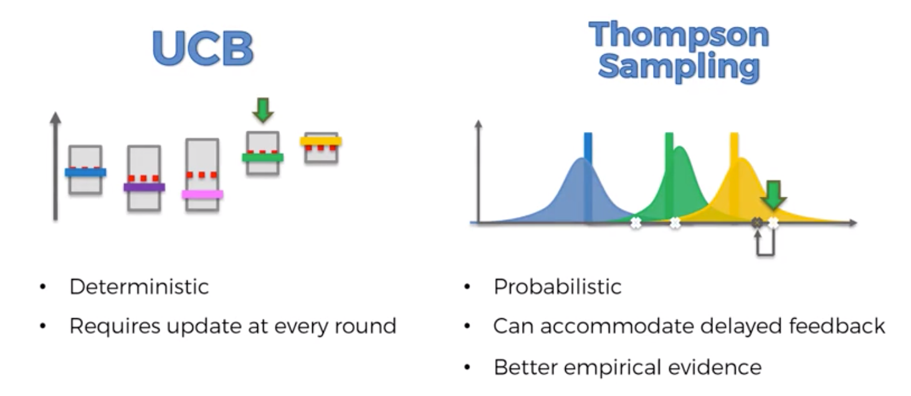

# Part 6: Reinforcement Learning

**Reinforcement Learning** is a branch of Machine Learning, also called Online Learning. It is used to solve interacting problems where the data observed up to time t is considered to decide which action to take at time t + 1. It is also used for Artificial Intelligence when training machines to perform tasks such as walking. Desired outcomes provide the AI with reward, undesired with punishment. Machines learn through trial and error.

**Distribution** is a listing or function showing all the possible values (or intervals) of the data and how often they occur. 

## Section 27: Upper Confidence Bound

**The Multi Armed Bandit Problem** is a problem in which a limited set of resources must be allocated between competing choices in a way that maximizes their expected gain, when each choice's properties are only partially known at the time of allocation, and may become better understood as time passes or by allocating resources to the choice. For example it solves a problem when you enter a casino and want to decide what slot machine to use. The longer you observe the more data you have to find the optimal slot machine, but if you start using it too late, then you can regret it.
One another example is ad campaign. Imagine you have 5 options for an ad and you have to pick only one. You can run multiple AB tests, but if you do them too much, then you spend a lot of time and money. So maybe in some options it is more profitable to pick not the best solution but one which is close to it and start using it earlier, so you will save money on AB tests and start earning extra money because of the new ad.

Here is explanation of the problem using ad campaign example:
We have d arms. For example, arms are ads that we display to users each time they connect to a web page.
Each time a user connects to this web page, that maks a round.
At each round n, we choose one ad to display to the user.
At each round n, ad i gives reward r(n) = 0 or 1, 1 if the user clicked on the ad and 0 if the user didn’t.
Our goal is to maximize the total reward we get over many rounds

**Upper Confidence Bound Algorithm**


So we start at the same confidence level for every option, choose an option to use and then increase or decrease confidence level depending on if the action we wanted to happen occured or it didnt. And in any case we decrease confidence interval of the option we used because we get more and more observations and therefore we more sure in the confidence level we got.


Implementation:
```python
# Importing libraries
import numpy as np
import matplotlib.pyplot as plt
import pandas as pd

# Importing the dataset
dataset = pd.read_csv('../../data_files/Ads_CTR_Optimisation.csv')

# Implementing UCB
import math
N = 10000
d = 10
ads_selected = []
numbers_of_selections = [0] * d
sums_of_reward = [0] * d
total_reward = 0

for n in range(0, N):
    ad = 0
    max_upper_bound = 0
    for i in range(0, d):
        if (numbers_of_selections[i] > 0):
            average_reward = sums_of_reward[i] / numbers_of_selections[i]
            delta_i  = math.sqrt(3/2 * math.log(n+1) / numbers_of_selections[i])
            upper_bound = average_reward + delta_i
        else:
            upper_bound = 1e400

        if upper_bound > max_upper_bound:
            max_upper_bound = upper_bound
            ad = i

    ads_selected.append(ad)
    numbers_of_selections[ad] += 1
    reward = dataset.values[n, ad]
    sums_of_reward[ad] += reward
    total_reward += reward

# Visualising the results
plt.hist(ads_selected)
plt.title('Histogram of ads selections')
plt.xlabel('Ads')
plt.ylabel('Number of times each ad was selected')
plt.show()
```

## Section 27: Thompson Sampling

It is another solution for the Multi Armed Bandit Problem.

Thompson Sampling Algorithm:
* Step 1. At each round n, we consider two numbers for each ad i:
            - N1  -  the number of times the ad i got reward 1 up to round n
            - N0  -  the number of times the ad i got reward 0 up to round n
* Step 2. For each ad i, we take a random draw from the distribution below: take formula from there: http://prntscr.com/o4wfsq
* Step 3. We select the ad that has the highest value

There is a distribution behind every slot machine. We pull an arm and construct a distribution several times for every machine. We don’t try to to predict distribution of a slot machine, but we know that the peak of the real distribution wil be somewhere in just created distribution. We take a random point from new distributions for every machine and check their returns. We pick a michine with the highest return, pull its arm, update distributions and the iteration is done.
Over the time new distribution will become higher and more narrow.

**UCB vs Thompson Sampling**

Thompson can be updated by batches and therefore it is much more computational friendly

Perfomance:
* random: 1126
* UCB: 2178
* Thompson: ~2600

Implementation:
```python
# Importing libraries
import numpy as np
import matplotlib.pyplot as plt
import pandas as pd

# Importing the dataset
dataset = pd.read_csv('../../data_files/Ads_CTR_Optimisation.csv')

# Implementing Thompson Sampling
import random
N = 10000
d = 10
ads_selected = []
numbers_of_rewards_1 = [0] * d
numbers_of_rewards_0 = [0] * d
total_reward = 0

for n in range(0, N):
    ad = 0
    max_random = 0
    for i in range(0, d):
        random_beta = random.betavariate(
            numbers_of_rewards_1[i] + 1,
            numbers_of_rewards_0[i] + 1
        )
        if random_beta > max_random:
            max_random = random_beta
            ad = i

    ads_selected.append(ad)
    reward = dataset.values[n, ad]

    if reward == 1:
        numbers_of_rewards_1[ad] += 1
    elif reward == 0:
        numbers_of_rewards_0[ad] += 1

    total_reward += reward

# Visualising the results
plt.hist(ads_selected)
plt.title('Histogram of ads selections')
plt.xlabel('Ads')
plt.ylabel('Number of times each ad was selected')
plt.show()
```
