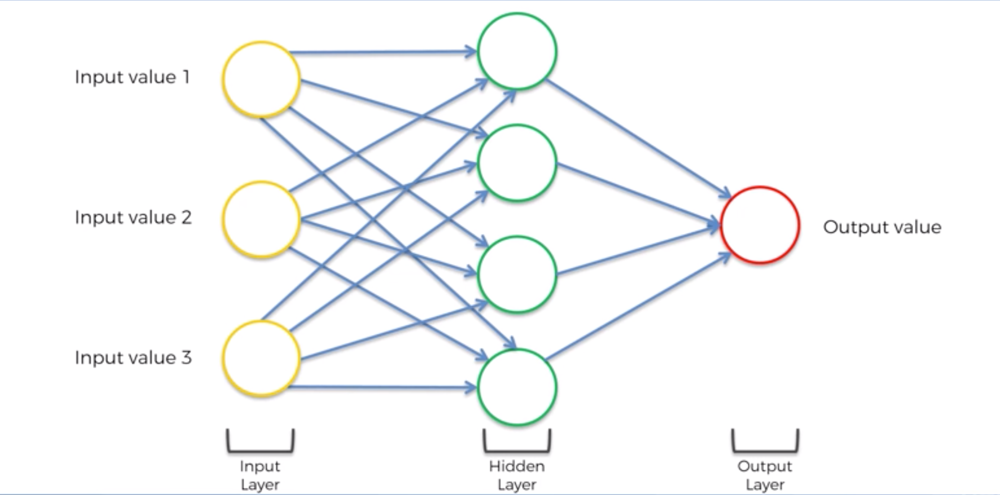
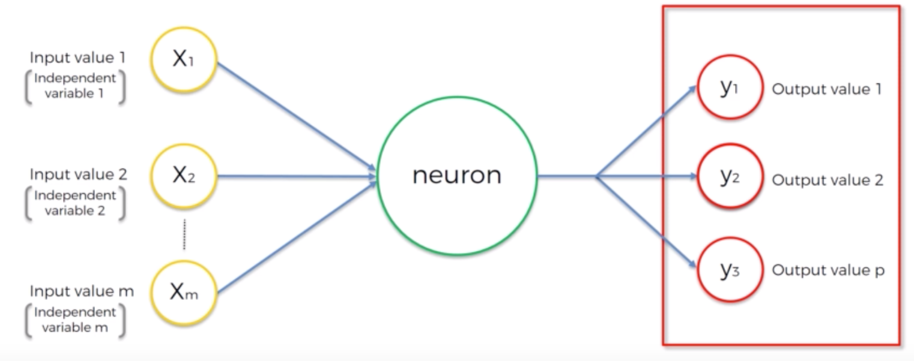
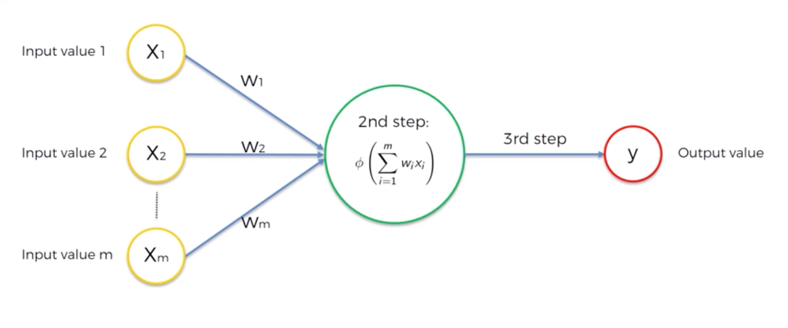
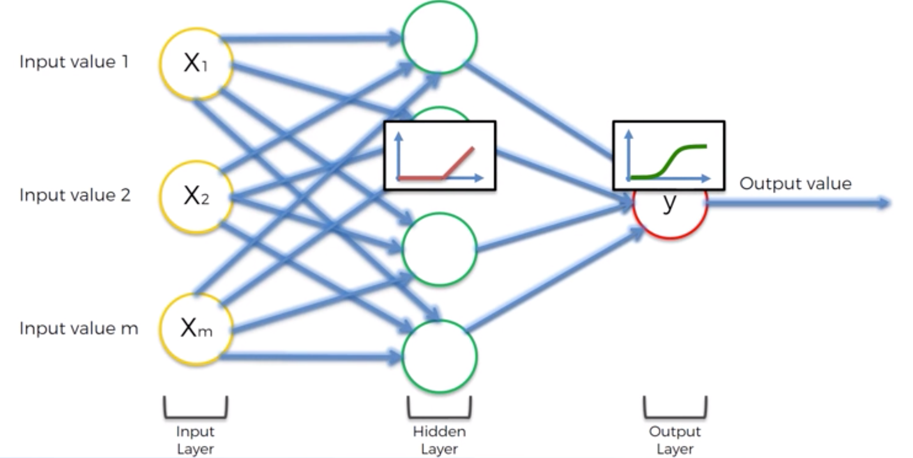
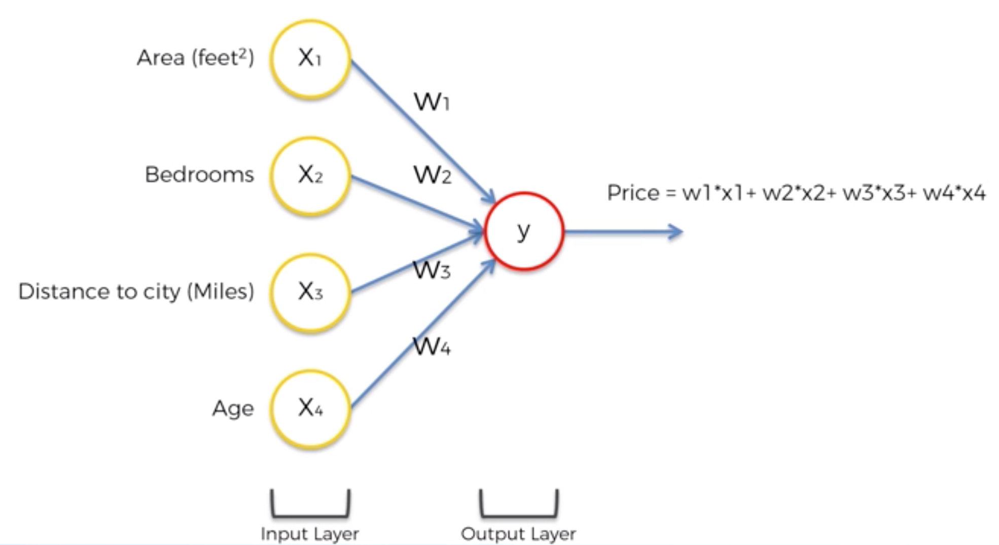
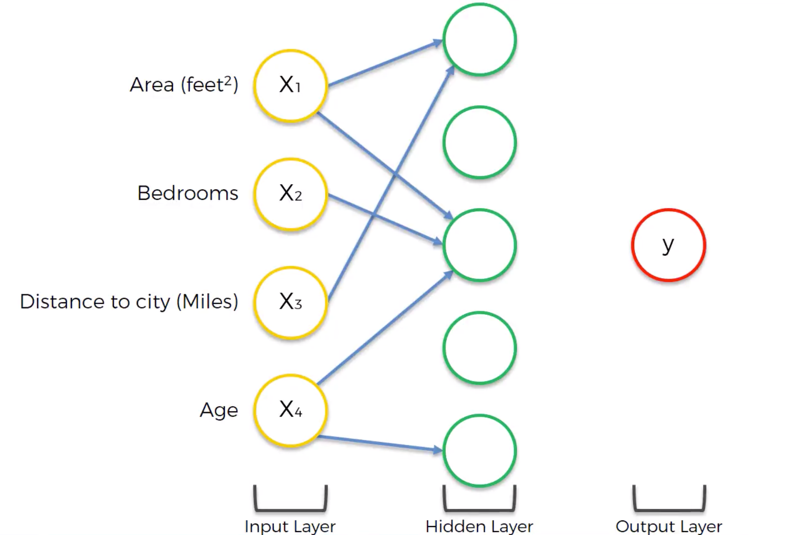
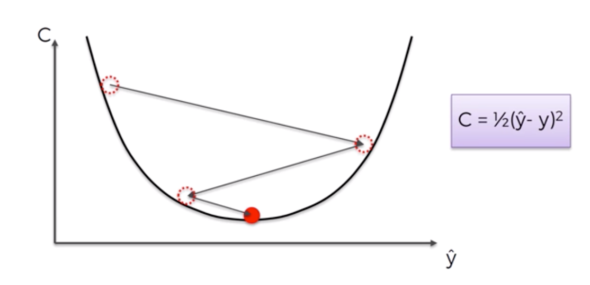
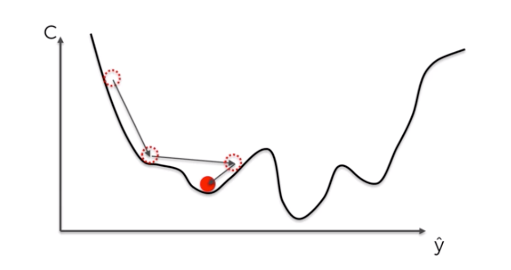
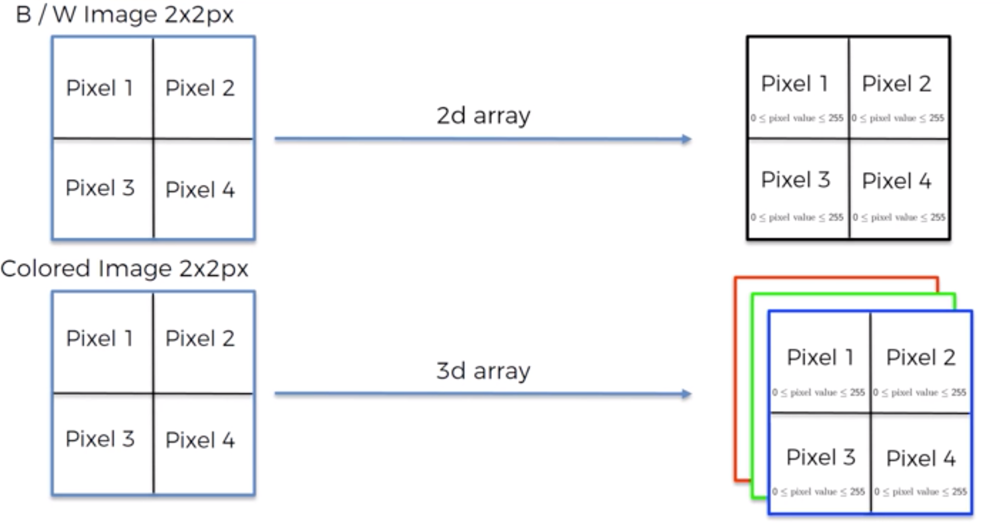
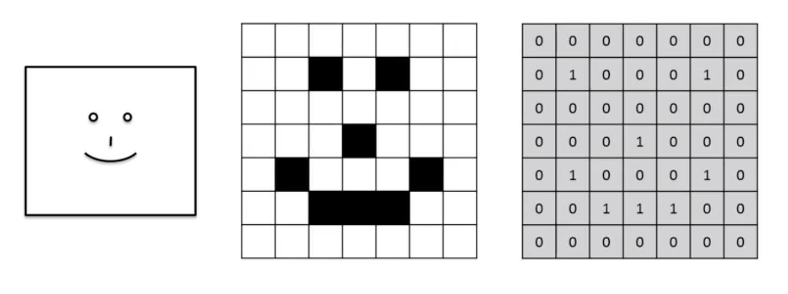

# Part 8: Deep Learning

## Section 31: Artificail Neural Networks
**Deep Learning** is part of a broader family of machine learning methods based on artificial neural networks. It tries to mimic how the human brain operates.


**Neuron**(or node) is the basic building block of ANNs. It gets input signals and has an output signal.



**Weights** are how neural networks learn by adjusting them. It decides what signal(aka feature) is more importand and what isn’t.
Neuron sum all inputs and apply an activation function. 
Then it passes the value forward.

An example of using two different activations functions in a small neural network: 

How do NNs work? Here is an example of building a NN for a real estate price estimator:
Simplest example of a NN without hidden layers: 
That way tou can describe any machine learning algorythm we already learned.
The extra power of NNs is in its hidden layer.
Every node in the hidden layer has its own speciality. One node can be specialized in finding apartments not far from the city centre but with a big area. It means that some input values will be more important for the node(distance, area) and other will not. This node will activate only when certain criteria is met.
Another node can look for big properties in new buildings, so it will take other parameters as priority ones - area and age. Then its result will be a new parameter which will be useful for big families which prefer modern buildings.
A node can work with a single input parameter. The higher property’s age the lower price. But if a building is 150 years old then it becomes a historic property and can be a positive marker for a higher evaluation.
That’s the power of a neural network that it can pick up parameters that we wouldn’t have thought of ourselves.
That we it creates many features just from 4 original features and we can use these new features to make a proper prediction.


How do NNs learn?
You create a neural network, you tell what input is, what you want as output and let it figure out what have to be done to match them.
If you want to distinguish cat and dogs, Instead of creating a regular program and trying to describe all things which explain how cats look like, you point a NN to a folder with merked images of cats and dogs and it finds all cats and dogs features by itself.
Here is how it happens step by step:
A neural network accepts data in the input layer, processed it using the weights, applies activation function and gets a result. Then it compares the predicted result with the actual value using Cost Functaion, feeds that information back and changes weights to get more accurate result. The goal is to minimize the value of the Cost Function. 
All of that happens for a single row of dataset. How will it handle multiple rows?
For n lines from a dataset it predicts n results, calculate a single Cross Function value and then goes back to adjust weights only once.
Important note that all the rows share the same weights.
After it’s done it’s called the Epoch. Epoch means the number of times a neural network processed wholde dataset.

**Back Propagation** is when a neural network gets Cross Function value and adjusts its own weights.

**Gradient Descent** is a method of optimization. It tells that you have to get a random point and find its slope. If it is descending then you have to get a value to the right of this point. If it is ascending, you have get a value to the left of this point. That way you will find weights to minimize crodd function value.


Disadvantage of gradient descent is that it requires the cross function to convex(i.e. has one global minimum). Otherwise it can end in a local minimum: 

**Stochastic Gradient Descent** is a version of gradient descent which doesn’t require convexing from the cost function. According to it, you should adjust the weights after every single row rather doing everything together. SGD works faster than regular GD.

`# TODO: Move it up ^`
The huge advantage of backpropagation is that you can adjust all weights at the same time, so you basically know which part of the error each of your weights is responsible for.

**Training the ANN with Stochastic Gradient Descent:**
* Step 1. Randomly initialise the weights to small numbers close to 0 but not 0
* Step 2. Input the first observation of your dataset in the input layer, each feature in one input node.
* Step 3. Forward Propagation: from left to right, the neurons are activated in a way that the impact of each neuron’s activation is limited by the weights, so weights basically determine how important each neuron activation. Propagate the activations until getting the predicted result y^.
* Step 4. Compare the predicted result to the actual result. Measure the generated error.
* Step 5. Back Propagation: from right to left, update the weights according to how much they are responsible for the error. The learning rate decides how much we update the weights.
* Step 6. Repeat steps 1 to 5 and update the weights after each observation(Reinforcement Learning) or 
             Repeat steps 1 to 5 but update the weights only after a batch of observations (Batch Learning)
* Step 7. When the whole training set passed through the ANN, that makes an epoch. Redo more epochs.

```
# TODO: put the implementation here

# output_dim - number of nodes in the hidden layer
# input_dim - nuber of nodes in the input layer

# batch_size - number of rowas 
```

Important note: if your data is linearly separable and dataset chart can be split by lines to classes, you dont need a neural network and should use another model.

A rule of thumb for choosing a number of nodes in a hidden layer is average value of nodes in input and output layers.
More accurate methods to find the number will be described later.

There is no rule how to choose proper batch size and number of epoch. It is an art and you have to experiment with it to find the optimal choice.


## Section 32: Convolutional Neural Networks

Human brain tries to detect features, certain patterns of an image in order to classify it. Sometimes people misrecognize objects after a very quick look because the brain didn’t have enough time to process all features of the object. Neural networks work the same way.

Convolutional Neural Networks work with images.
They treat images as two dimensional arrays:


They accept an image, process  and classify it:
* Step 1. Convolution
* Step 2. Max Pooling
* Step 3. Flattening
* Step 4. Full connection

**Convolution.**
**Feature detector / Kernel / Filter** is a matrix
You get a feature detector and put it over the image matrix. Then you multiply feature detector and the peace of the image matrix underneath it by element and sum all values. The result value goes to the feature map(or activation map). Then it slides forward for one pixel and everything happens again. 
54 http://prntscr.com/o6c9cq
At the end the size of the image is reduced and we have a bunch of feature maps.
http://prntscr.com/o6ccsz

One set of applying feature detectors is a single layer of a CNN. It’s output is data about what features(pieces of objects) were found, for example at first level we can find claws, ears, eyes. At the second layer we use features we found at the first layer to detect more complex objects like paw, head, tail. At the third level we use bigger objects we found to detect even bigger objects or we can try to use them to make a prediction if the input image is an image of a dog or a cat. 
Examples of objects are presented for better understanding of how CNN works. In most cases CNN’s features will mean nothing for humans, but nevertheless they work.

The primary purpose of convolution is is to find features in your image using feature detector, put them into a feature map and by having them in a feature map it still preserves the spatial relationships between pixels. It is very important, otherwise we would lose the pattern

Max Pooling is a technic which allows CNN to work with rotated, squashed images or images with some distortions successfully.
Max pooling. It works with matrices as convolution, but in that case it gets result as the biggest value in the area underneath max pooling box. So it has less data but all features are still recognizable
http://prntscr.com/o6d5uv
http://prntscr.com/o6dah9

Paper: Evaluating of pooling operations in convolutional architectures for object recognition

Flattening is a technic when you create make all your pooled feature maps an array of values so it is reade to becomes the input layer of a future ANN.
http://prntscr.com/o6dgwk

After we finish max pooling step we have a big number of features encoded in numbers and that’s good data to be consumed by ANN.
Full Connection is a step when we add and ANN to the existing model: 
http://prntscr.com/o6dhi2
http://prntscr.com/o6dxwa
http://prntscr.com/o6e02v

Then an ANN works as usual. The interesting thingh though is that backpropagation in case of a CNN is more complex. It goes from the very end of a CNN to the very beginning, so back propagation updates not just weights in the ANN but alse feature detectors in the convolutional layer.

Final scheme of CNN: http://prntscr.com/o6e0po

Data structure required by keras
```
  — dataset
      — test_set
         — class_1 (cats)
         — class_2 (dogs)
      — training_set
         — class_1 (cats)
         — class_2 (dogs)
```

```
# TODO: Put the code here

# nb_filters - number of feature detectors to apply on the inout image
# all images have to be resized to a single format

# mark extra convolutional layer
```

# TODO: можешь пересмотреть часть 8 еще раз, особенно обьяснения теории в практических занятиях

Image augmentation is an approach when you get initial set of images and apply some functions like rotating, squashing, cropping or flipping. That way you can make the dataset much bigger and it will lead to a better accuracy and prevent overfitting.


