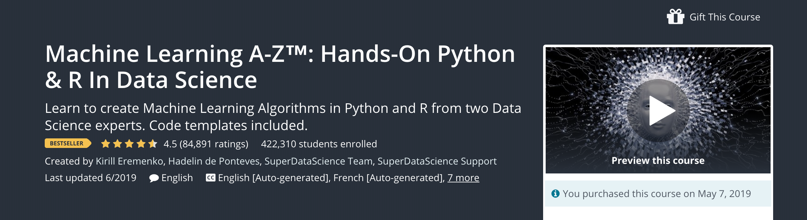

# Summary of the "Machine Learning A-Z" online course

I find this course to be very good and informative. I particularly like the parts about regressors, classifiers and neural networks. Of course they couldn't cover a lot of things of such big and complex topic as Deep Learning, but general concepts were explained excellently. I also appreciate it that lecturers didn't talk much about complex math behind algorithms and were more aimed at to talk about concepts' intuition. It also allowed them to fit more models and algorithms into the course. When it comes to practice, the guys go straight to the point and implement models solving real life problems. Sometimes the lecturers spend too much time explaining very basic python things, so that's very useful to have all code-related information in this document.

### Contents:
* Part 1: [Data Preprocessing](src/1_data_preprocessing.md)
* Part 2: [Regression](src/2_regression.md)
* Part 3: [Classification](src/3_classification.md)
* Part 4: [Clustering](src/4_clustering.md)
* Part 5: [Association Rule Learning](src/5_association_rule_learning.md)
* Part 6: [Reinforcement Learning](src/6_reinforcement_learning.md)
* Part 7: [Natural Language Processing](src/7_natural_language_processing.md)
* Part 8: [Deep Learning](src/8_deep_learning.md)
* Part 9: [Dimensionality Reduction](src/9_dimensionality_reduction.md)
* Part 10: [Model Selection & Boosting](src/10_model_selection.md)
