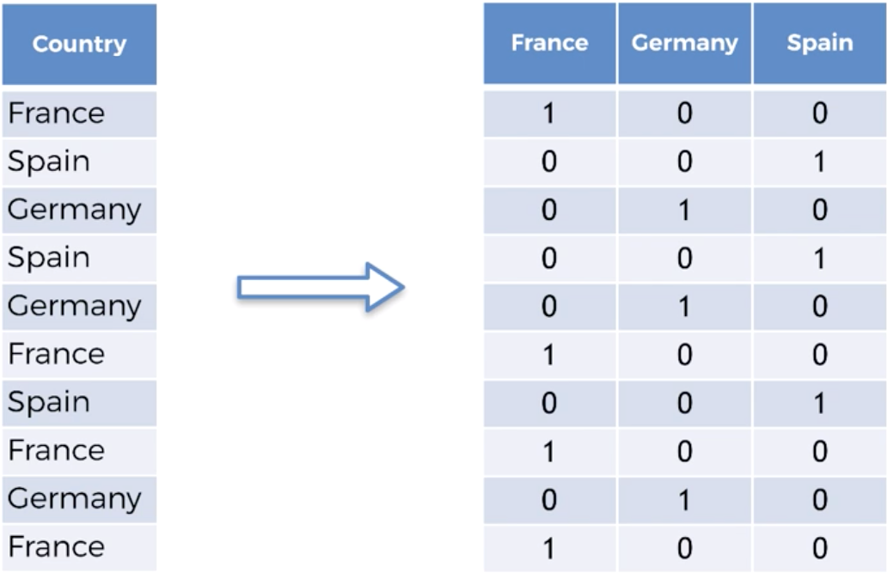

# Part 1: Data Preprocessing

There are differnt types of variables - dependent and independent.
We use independent variables to predict dependent ones.
For example, we use country, age and salary variables to predict sales.

Pandas is the library to work with datasets.

```python
import pandas as pd
dataset = pd.read_csv(‘dataset.csv’)
X = pd.iloc[;, ;-1]
# the first index means ‘get all lines’, the second index means ‘get all columns but last'
```

In case you have empty cells in a dataset it is better to fill them with mean values rather delete lines:
```python
from sklearn.preprocessing import Imputer
imputer = Imputer(missing_values=’NaN’, strategy=‘mean’, axis=0)
imputer = imputer.fir(dataset)
transformed_dataset = imputer.transform(dataset)
```

Categorical data has to be interchanged with numbers, so we have to use «One Hot Encoding».
It will turn all categories into columns and set 1 if this column is true for the line and 0 if it isn’t.
It is also called «Dummy Variable»


```python
from sklearn.preprocessing import LabelEncoder, OneHotEncoder
labelencoder = LabelEncoder()
dataset = labelencoder.fit_transform(dataset)
onehotencoder = OneHotEncoder(categorical_features = [0])
dataset = onehotencoder.fit_transform(dataset).to_array()
```

Every dataset has to be split into two parts - training set and test set.
We use training set to build a model and test set to check its accuracy.
```python
from sklearn.cross_validation import train_test_split
X_train, X_test, y_train, y_test = train_test_split(X, y, test_size=0.2, random_state=0)
```

**Feature scaling** (some python libraries dont require it)
We have to put all numbers on the same scale, becuase ML algorythms calculate square difference and it quite
depends on range of values. So instead of 40 … 60 in age column and 40000 - 100000 in salary column we will
have -1…1 in every column. We use normalization or standartization for that.
```python
from sklearn.preprocessing import StandardScaler
scaler = StandardScaler()
X_train = scaler.fit_transfrom(X_train)
X_test = scaler.transfrom(X_test)
```


