# Part 2: Regression

**Regression**  — technic to determine relationships between variables

**Linear Regression**  —  specific type of a regression when you describe dependent variable(y) by a line (linear expression), so every point of it is a prediction for a given X

## Section 4
**Simple Linear Regression**
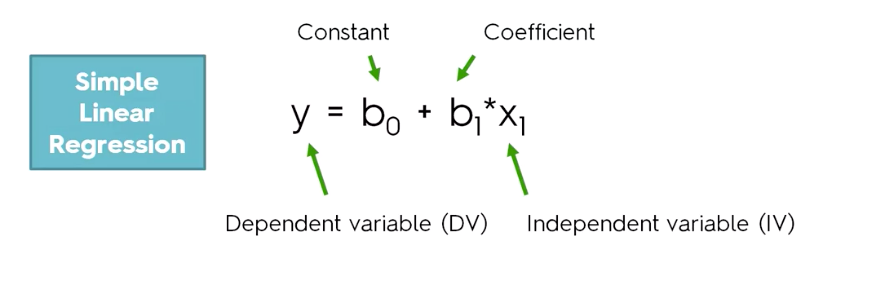
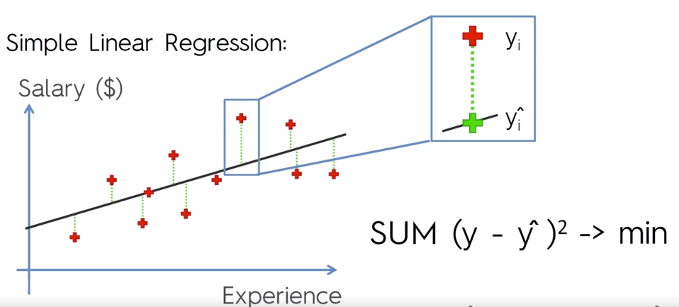

You create this line by minimizing square of distance between dots which represent our data and dots on the line.
```python
from sklearn.linear_model import LinearRegression
regressor = LinearRegression
regressor.fit(X_train, y_train)  # after that it learned correlation between X and y
y_predictions = regressor.predict(X_test)
```

**Results visualization.** It is good to display input data and prediction to ensure that predictions are close to
real data in both graphs. It is very important to check that predictions are good for data which did not
participate in model training
```python
import matplotlib.pyplot as plt
# Visualizing the Training set results
plt.scatter(X_train, y_train, color = 'red')
plt.plot(X_train, regressor.predict(X_train), color = 'blue')
plt.title('Salary vs Experience (Training set)')
plt.xlabel('Years of Experience')
plt.ylabel('Salary')
plt.show()

# Visualizing the Test set results
plt.scatter(X_test, y_test, color = 'red')
plt.plot(X_train, regressor.predict(X_train), color = 'blue')
plt.title('Salary vs Experience (Test set)')
plt.xlabel('Years of Experience')
plt.ylabel('Salary')
plt.show()
```


##Section 5
**Multiple Linear Regression**  -  that’s basically the same thing as Simple Linear Regression, but with multiple variables and each of them has its own coefficient.
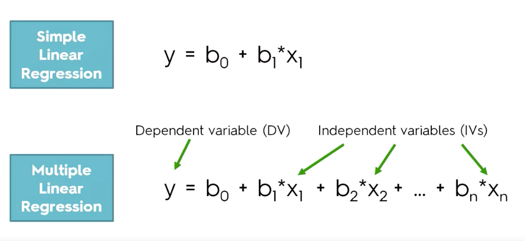

Assumptions of a Linear Regression: 
* Linearity
* Homoscedasticity
* Multivariate normality
* Independence of errors
* Lack of multicollinearity

If your model does not satisfy all assumptions, then probably you should not use linear regression model.
These assumptions are not explained in the course but you can find more information about it there: [link](https://www.kdnuggets.com/2016/06/brief-primer-linear-regression-part-2.html)


**Dummy Variable Trap**  —  you should never include all dummy variables (variables you created with OneHotEncoder) at the same time.  For example, if you have two variables and a condition that sum of all of them equals to 1 (which is true for dummy variables), then it is enough to use only one variable. The reason for this is that you duplicate data (D2 = 1 - D1) and it breaks multicollinearity assumption mentioned above. So to recap: ALWAYS OMIT ONE DUMMY VARIABLE.
```python
# Just skip first column of a dataset after you applied OneHotEncoder to avoid Dummy Variable Trap
X = X[:, 1:]
```

**P-value** means how statistically important a variable is. The lower the value the more important it is for making predictions.

5 methods of building models:
* All-in
* Backward Elimination
* Forward Selection
* Bidirectional Elimination
* All Models
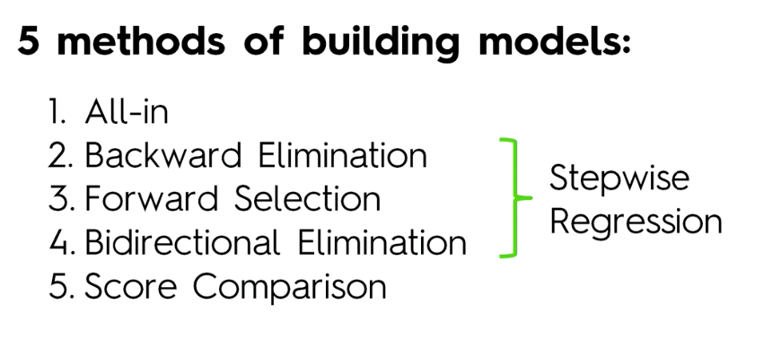


**All-in.** Use all of your variables. Can be used as preparation for Backward Elimination
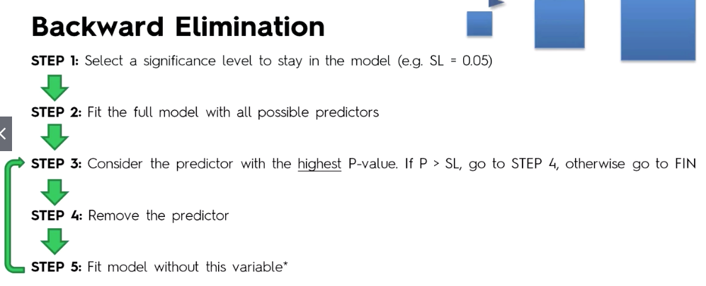
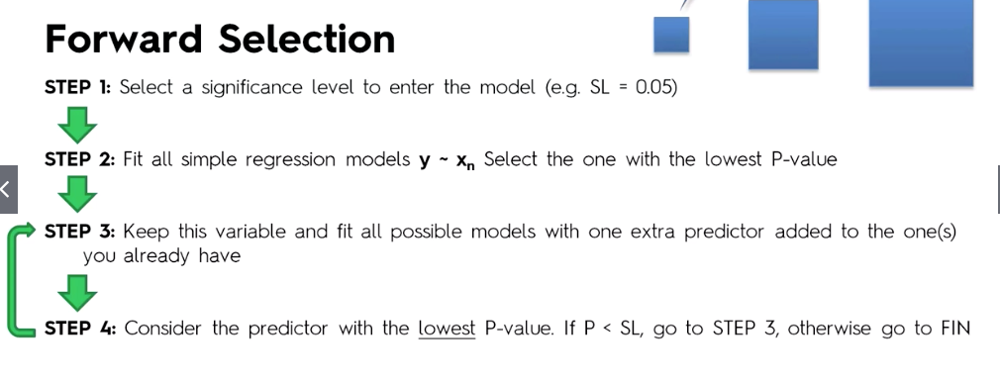
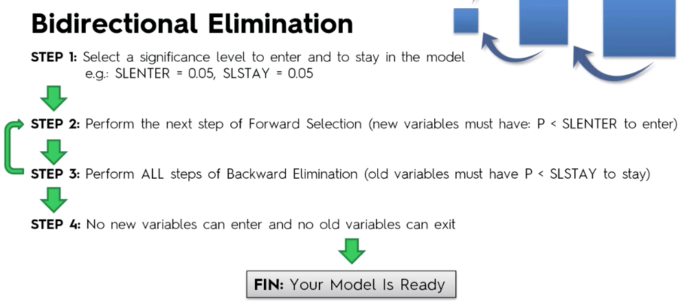
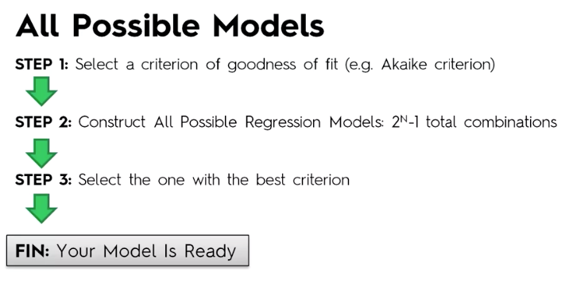

Implementation:
```
from sklearn.linear_model import LinearRegression
regressor = LinearRegression()
regressor.fit(X_train, y_train)
y_pred = regressor.predict(X_test)
```

Complete source code of the python script: [link](https://github.com/tanvirrazin/Machine-Learning-A-Z-Udemy/blob/master/part_2-regression/multiple-regression/multiple_linear_regression.py)

**Backward Elimination**  —  a method to find the optimal prediction model. We remove variables one by one and observe results. You can get details of a model using `.summary()` method.

## Section 6
**Polynomial Regression** is absolutely the same thing as Multiple Linear Regression but variables can have power higher than 1, so the graph will be a curve.
It’s still linear just because this word doesn’t describe relation between Y and X, it refers to B coefficients
```python
Y = b0 + b1*x1 + b2*x2^2 + … + bn*xn^n
```

Implementation:
```python
from sklearn.linear_model import LinearRegression
from sklearn.preprocessing import PolynomialFeatures

poly_reg = PolynomialFeatures(degree=2)
X_poly = poly_reg.fit_transform(X)
lin_reg = LinearRegression()
lin_reg.fit(X_poly, y)
```

Visualizing the results
```python
import matplotlib.pyplot as plt

plt.scatter(X, y, color=«red»)  # dots with original input data
plt.plot(X, lin_reg.predict(X), color=«blue»)  # plot predictions
# for polynomial regression
# plt.plot(x, lin_reg_poly.predict(poly_reg.fit_transform(X), color=«blue»)
plt.title(«Result Plot»)
plt.xlabel(«Position Level»)
plt.ylabel(«Salary»)
```

TODO: PUT PYTHON REGRESSION TEMPLATE HERE


## Section 7
**Support Vector Regression (SVR)**  —  type of a SVM that supports linear and not linear regressions. SVR has different regression goal. In linear regression we try to minimize the error between the prediction and data. In SVR our goal is to make sure that errors don’t exceed the threshold.
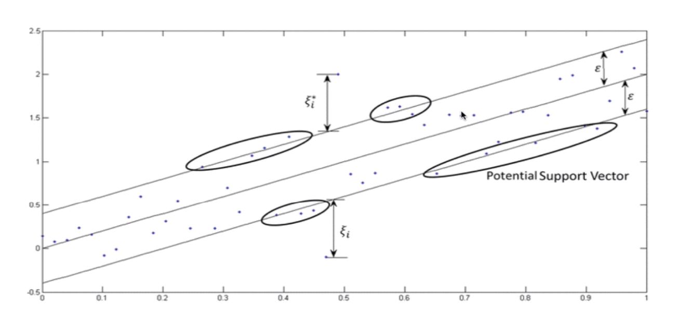
Every point represents a dimensions. These vectors are used to prform linear regression

Implementation
```python
### SVR requires feature scaling
from sklearn.preprocessing import StandardScaler
sc_X = StandardScaler()
sc_Y = StandardScaler()
X = sc_X.fit_transform(X)
Y = sc_Y.fit_transform(Y)
###

from sklearn.smv import SVR

regressor = SVR(kernel=‘rbf’)
regressor.fit(X, y)
raw_result = regressor.predict(sc_X.transform(np.array([[input]])))
resut = sc_Y.inverse_transform(raw_result)
```


## Section 8
**Decision tree** builds regression or classification models in the form of a tree structure. It breaks down a dataset into smaller and smaller subsets while at the same time an associated decision tree is incrementally developed. The final result is a tree with decision nodes and leaf nodes. A decision node (e.g., Outlook) has two or more branches (e.g., Sunny, Overcast and Rainy), each representing values for the attribute tested. Leaf node (e.g., Hours Played) represents a decision on the numerical target. It’s first non-linear and non-continious model in the course.

The algorithm is easy. We split dataset into groups until it adds up some valuable information. After it is done, we calculate average value for every leaf:
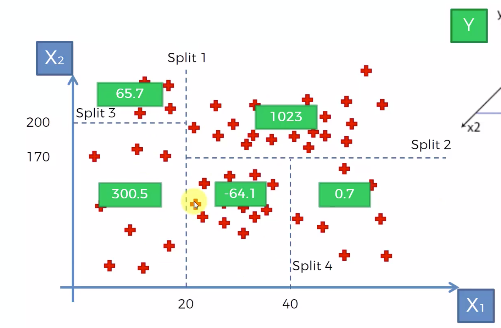
After we get an input, we check what leaf it is in and immediately assign average value of the leaf as the result value.
At the end we have convenient decision tree: 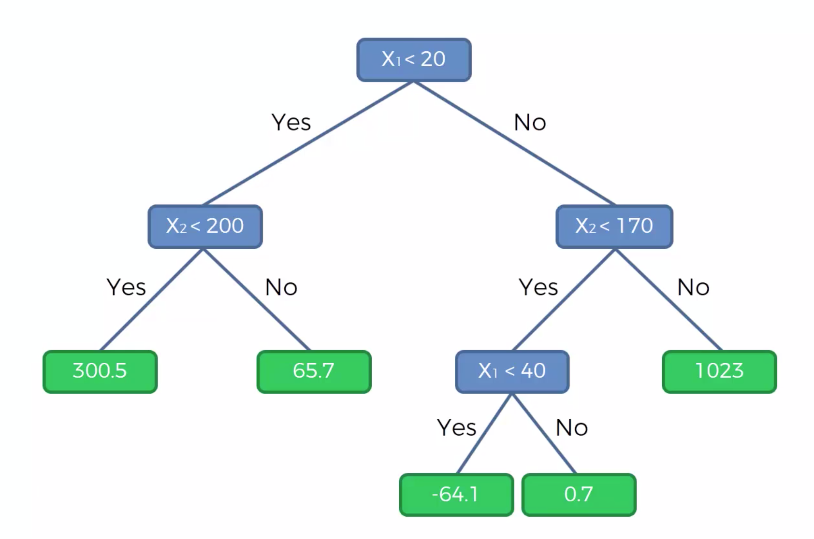

Implementation:
```python
from sklearn.tree import DecisionTreeRegressor
regressor = DecisionTreeRegressor(random_state=0)
regressor.fit(X, y)
```
 

## Section 9
**Random Forest Regression**

**Ensemble learning**  —  is when you get multiple algorithms or the same algorithm multiple times to make a model more powerful than the original one

**Random Forest Intuition:**
* Get a subset of the dataset
* Build a decision tree using the subset
* Repeat Steps 1 and 2 as many times as many trees you want to have in your model
* For an input value, apply all your trees and get average value of all results

```python
from sklearn.ensemble import RandomForestRegressor
regressor = RandomForestRegressor(n_estimators=10, random_state=0)
regressor.fir(X, y)
```

## Section 10
Evaluating Regression Model Performance

**R squared**  —  a value which is used to evaluate accuracy of a model(greater is better).
`R^2 = 1 - SSres / SSavg`.
To calculate it we get squared distances from the line provided by model(SSres) and squared distances from the average line (SSavg)
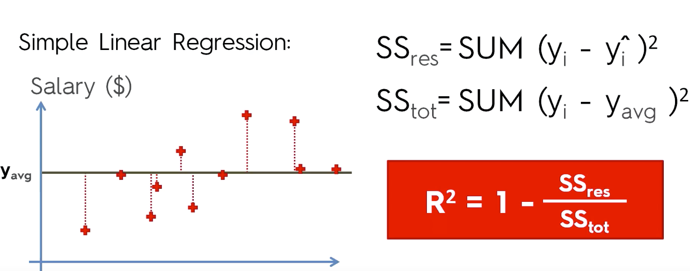

**Adjusted R squared**  —  R squared is not quite representative when you add more variables, that’s why we should use adjusted formula.
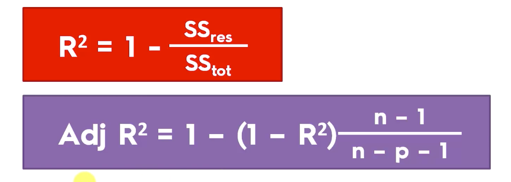

The usage of it is very simple. You can create multiple models and check their adjusted R squared value. The model with higher value is the best one.

Cheat sheet with pros and cons of different regression models: [link](https://sds-platform-private.s3-us-east-2.amazonaws.com/uploads/P14-Regression-Pros-Cons.pdf)
