# Part 3:  Classification

## Section 12: Logistic Regression
**Logistic regression** is a model which uses the logistic function for predicting probability.
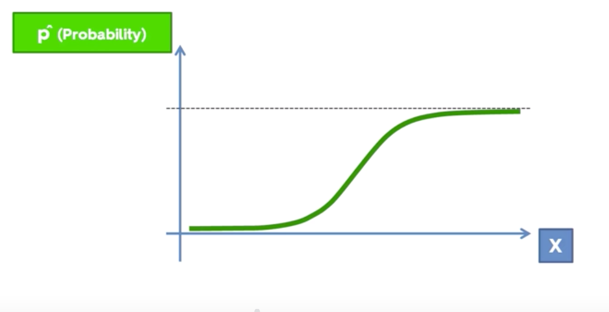
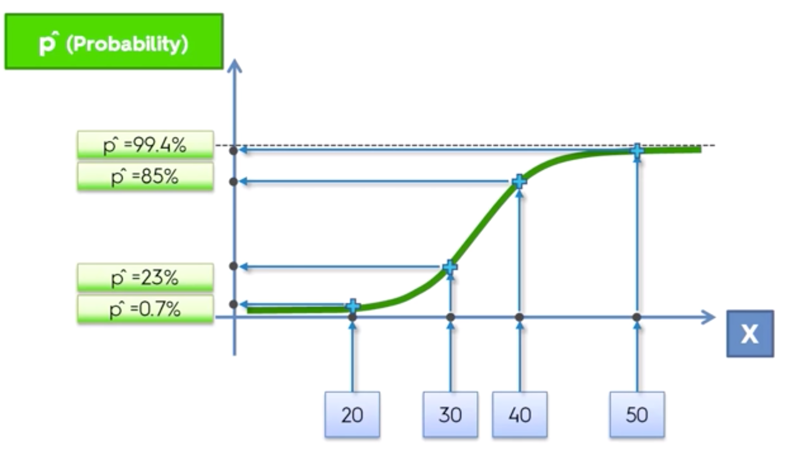

Implementation:
```python
from sklearn.linear_model import LogisticRegression
classifier = LogisticRegression(random_state=0)
classifier.fit(X_train, y_train)
classifier.predict(X_test)
```

Model Evaluating.
First of all we can display confusion matrix for the trained model
```python
from sklearn.metrics import confusion_matrix
cm = confusion_matrix(y_test, y_pred)
>>> ([65, 3],
     [8, 24])
```

Python Classification Template
```python
# Importing the libraries
import numpy as np
import matplotlib.pyplot as plt
import pandas as pd

# Importing the dataset
dataset = pd.read_csv('../../data_files/Social_Network_Ads.csv')
X = dataset.iloc[:, [2, 3]].values
y = dataset.iloc[:, 4].values

# Splitting the dataset into the Training set and Test set
from sklearn.model_selection import train_test_split
X_train, X_test, y_train, y_test = train_test_split(X, y, test_size=0.25, random_state=0)

# Feature Scaling
from sklearn.preprocessing import StandardScaler
sc_X = StandardScaler()
X_train = sc_X.fit_transform(X_train)
X_test = sc_X.transform(X_test)

# Fitting classifier to the Training set
# Create your classifier here

# Predicting the Test set results
y_pred = classifier.predict(X_test)

# Making the confusion Matrix
from sklearn.metrics import confusion_matrix
cm = confusion_matrix(y_test, y_pred)

# Visualizing the Training set results
from matplotlib.colors import ListedColormap
X_set, y_set = X_train, y_train
X1, X2 = np.meshgrid(np.arange(start=X_set[:, 0].min() - 1, stop=X_set[:, 0].max() + 1, step=0.01),
                     np.arange(start=X_set[:, 1].min() - 1, stop=X_set[:, 1].max() + 1, step=0.01))

plt.contourf(X1, X2, classifier.predict(np.array([X1.ravel(), X2.ravel()]).T).reshape(X1.shape),
             alpha=0.75, cmap=ListedColormap(('red', 'green')))
plt.xlim(X1.min(), X1.max())
plt.ylim(X2.min(), X2.max())
for i, j in enumerate(np.unique(y_set)):
    plt.scatter(X_set[y_set == j, 0], X_set[y_set == j, 1],
                c=ListedColormap(('red', 'green'))(i), label=j)
plt.title('Logistic Regression (Training set)')
plt.xlabel('Age')
plt.ylabel('Estimated Salary')
plt.legend()
plt.show()

# Visualizing the Test set results
from matplotlib.colors import ListedColormap
X_set, y_set = X_test, y_test
X1, X2 = np.meshgrid(np.arange(start=X_set[:, 0].min() - 1, stop=X_set[:, 0].max() + 1, step=0.01),
                     np.arange(start=X_set[:, 1].min() - 1, stop=X_set[:, 1].max() + 1, step=0.01))

plt.contourf(X1, X2, classifier.predict(np.array([X1.ravel(), X2.ravel()]).T).reshape(X1.shape),
             alpha=0.75, cmap=ListedColormap(('red', 'green')))
plt.xlim(X1.min(), X1.max())
plt.ylim(X2.min(), X2.max())
for i, j in enumerate(np.unique(y_set)):
    plt.scatter(X_set[y_set == j, 0], X_set[y_set == j, 1],
                c=ListedColormap(('red', 'green'))(i), label=j)
plt.title('Logistic Regression (Test set)')
plt.xlabel('Age')
plt.ylabel('Estimated Salary')
plt.legend()
plt.show()
```
Basically it is the same template as we had before, but now we have classifier instead of regressor.


## Section 13: K-Nearest Neighbors (KNN)

Steps:
* Choose the number K of neighbors. Most common default value for K is 5.
* Take the K nearest neighbors of the new data point according to the Euclidean distance
* Among these K neighbors, count the number of data points in each category
* Assign the new data point to the category where you counted the most neighbors
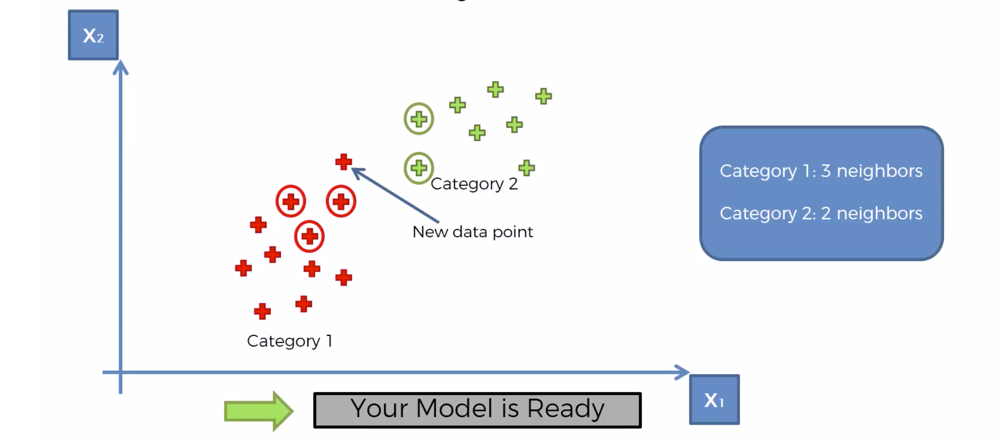

```python
from sklearn.neighbors import KNeighborsClassifier

# two last parameters are used to tell the classifier to use Euclidean distance
classifier = KNeighborsClassifier(n_neighbors=5, metric=‘minkowski’, p=2)
classifier.fit(X_train, y_train)
classifier.predict(X_test)
```

The result model is much more accurate than logistic regression and its chart makes more sense: 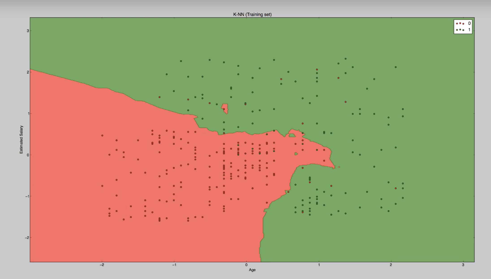


## Section 14: Support Vector Machine (SVM)
Support Vector Machine draws a line between two vectors. In case of two dimensional space, vectors are just points. It draws the line a way so it maximizes the margin between every vector and the line. How does it choose vectors among all training set entries? It gets extreme values of every class and that’s its feature. It is good at distinguishing apples from oranges when an apple looks like an orange and vice verse. The reason of it is that other algorithms create an image of an orange based on most common characteristics and determine how close a new data entry to the image. SVM determines an extreme line using most weird orange so it treats everything which look more similar to an orange as an orange for sure.
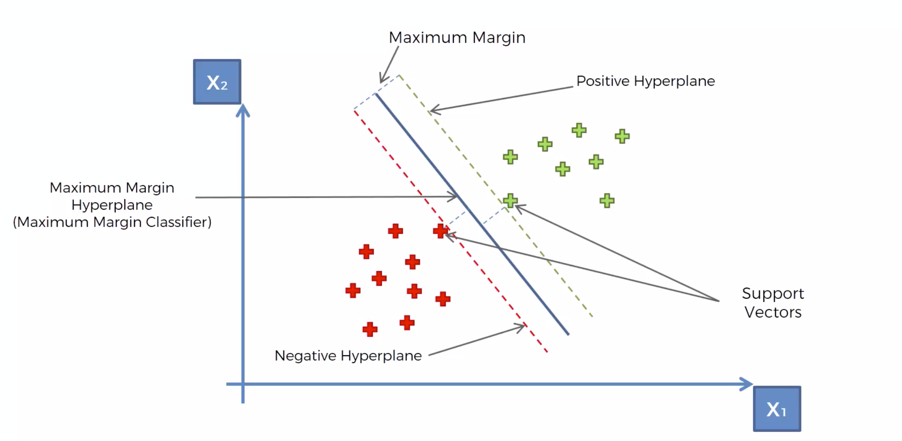

```python
from sklearn.svm import SVC

classifier = SVC(kernel=‘linear’)
classifier.fit(X_train, y_train)
```
Ther are multiple kernels and it is a good thing to try several of them. Linear kernel means that there will be straight line between two classes and often it is not what we need.

## Section 15: Kernel SVM
Sometimes you can’t separate dataset by a line: 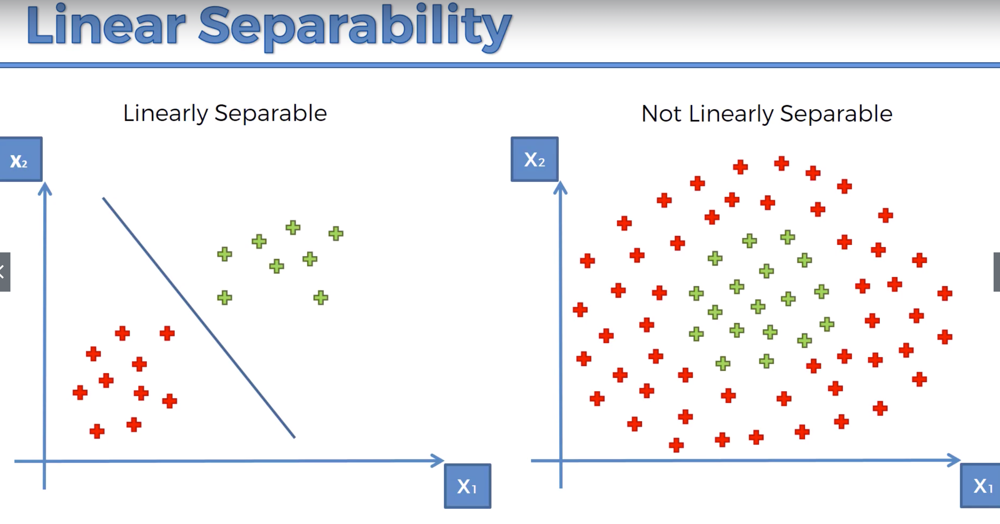
In that case we can map data to a higher dimensional space to make it linearly separable

1D -> 2D:  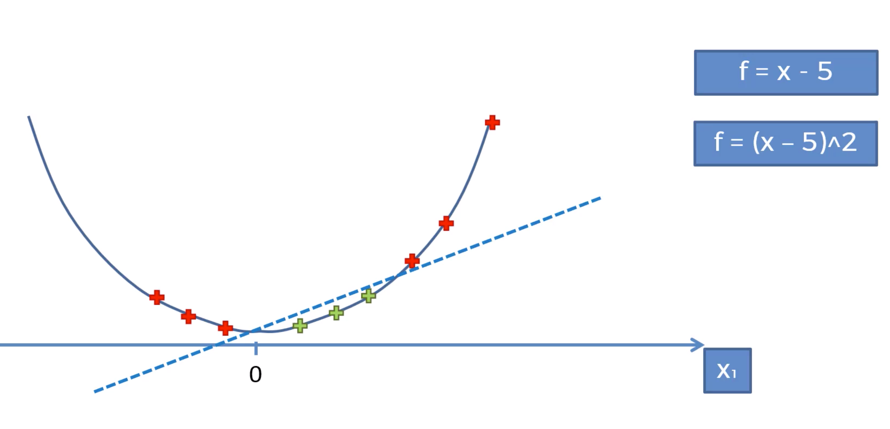
2D -> 3D:  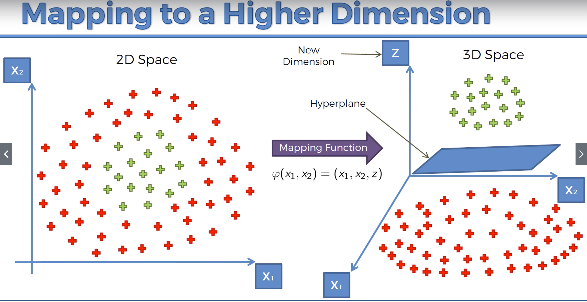
The problem of this approach is that the mapping can be highly compute intensive.

The best approach is to work with Kernel SVM.
Kernel SVM uses kernel functions which enable it to operate in a high-dimensional space without ever computing the coordinates of the data in that space.
Here is a list of kernel functions: [link](https://web.archive.org/web/20170408175954/http://mlkernels.readthedocs.io/en/latest/)

```python
classifier = SVC(kernel=‘rbf’)
```
If we change kernel to ‘rbf’, then the boundary line becomes a curve and based on the datased is used in the course, number of mispredictions decreased by 30%
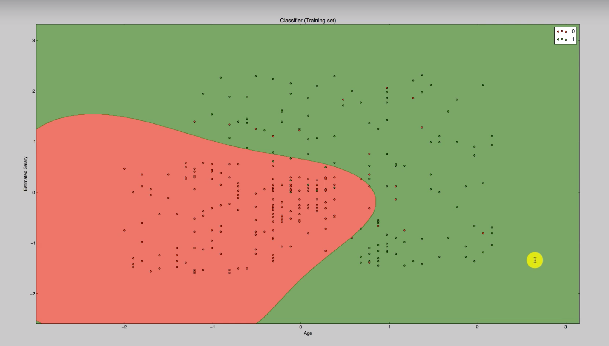


## Section 16: Naive Bayes
**Bayes’ Theorem**  describes the probability of an event, based on prior knowledge of conditions that might be related to the event. For example, if cancer is related to age, then, using Bayes' theorem, a person's age can be used to more accurately assess the probability that they have cancer, compared to the assessment of the probability of cancer made without knowledge of the person's age.
Here is an example of application: 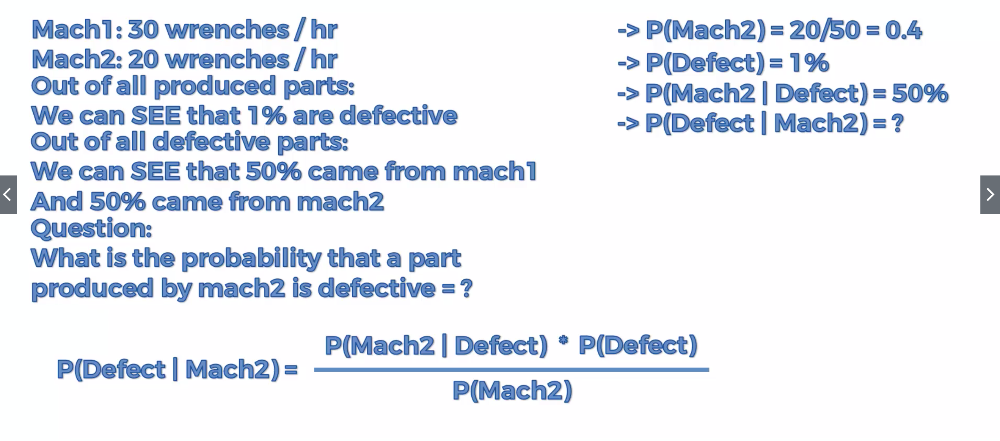
And some intuition: 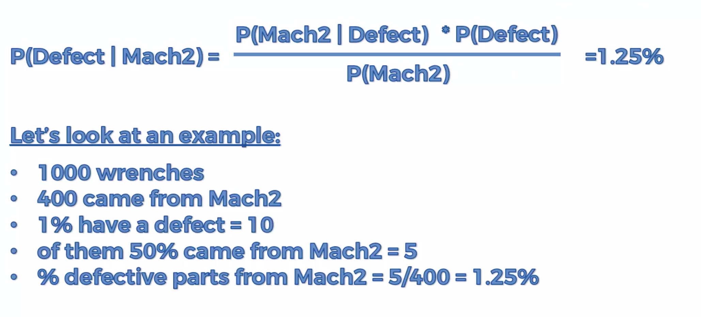

Basically we just calculate this:


The way you can simplify calculations(but only for comparison): 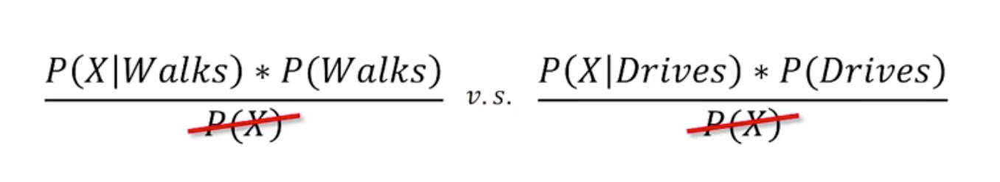

```python
from sklearn.naive_bayes import GaussianNB

classifier = GaussianNB()
classifier.fit(X_train, y_train)
```
Result chart: 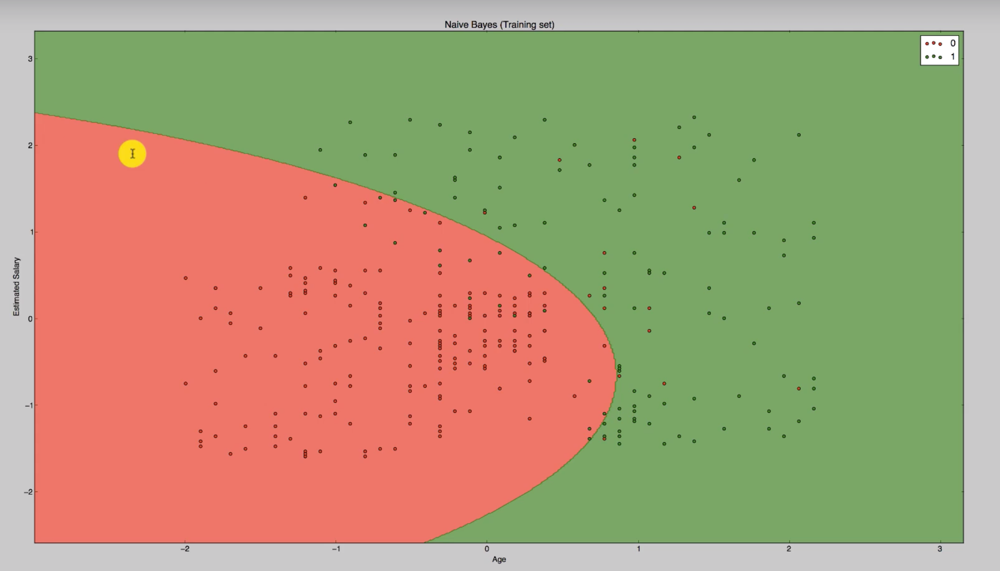


## Section 17: Decision Tree Classification
**Decision Tree Classification** is very similar to Decision Tree regression. The only thing which is different is that we don’tt calculate average value for a leaf. We split a dataset until it minimize entropy(make the data less chaotic and more ordered) and when it’s done we have a tree which can predict a class.

Decision tree is quite a simple method but at the same time it lies in the foundation of some modern and more powerful methods in machine learning.

```python
from sklearn.tree import DecisionTreeClassifier

classifier = DecisionTreeClassifier()
classifier.fit(X_train, y_train)
```

Result chart: 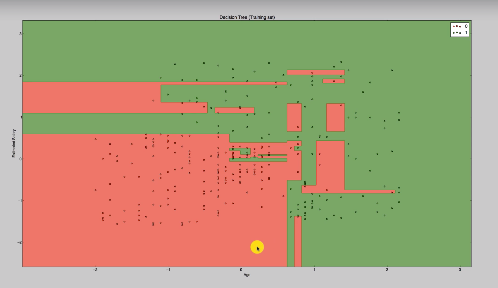


## Section 18: Random Forest Classification

**Ensemble learning** is when you take multiple machine learning algorithms and put them together to create one bigger algorithm.

* Step 1. Pick K random data points from the training set.
* Step 2. Build a decision tree associated to these K data points
* Step 3. Choose number N of trees and repeat previous steps N times
* Step 4. For a new data point, make all trees predict and select category which has more votes from trees.

So yeah, it is very similar to random forest regression.

```python
from sklearn.ensemble import RandomForestClassifier
classifier = RandomForestClassifier(n_estimators=10)  # n_estimators - the number of trees
classifier.fit(X_train, y_train)
classifier.predict(input)
```

Result chart: 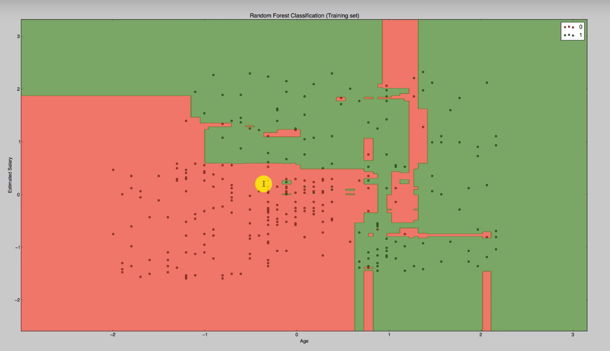

You have to pay extra attention to overfitting when you work with trees.
To conclude after we tried the last classifier, the best models with most precise predictions are Kernel SVM and Naive Bayes Classifier


## Section 17: Evaluating Classification Models Performance

**False Positives** is when we predicted positive outcome but it was false. **False Negative** is the same thing, but when the original prediction was negative.
Usually False Negative is more important and dangerous than False Positive, so keep that in mind when you read confusion matrix.

**Confusion Matrix** is a specific table layout that allows visualization of the performance of an algorithm. It contains information about correct predictions, false positives and false negatives: 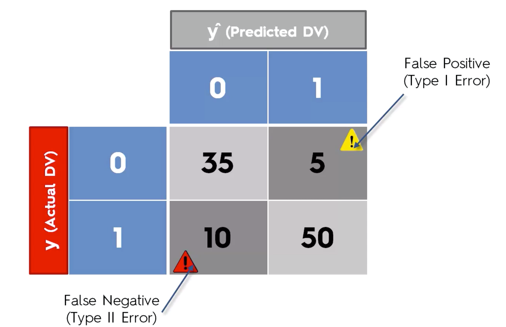

Accuracy Rate = Correct / Total
Error Rate = Wrong / Total

**Accuracy Paradox.** Sometimes If you always return negative or positive result instead of predicting, you can get better accurace rate. It means that you shouldn’t base your judgment only on accuracy rate: 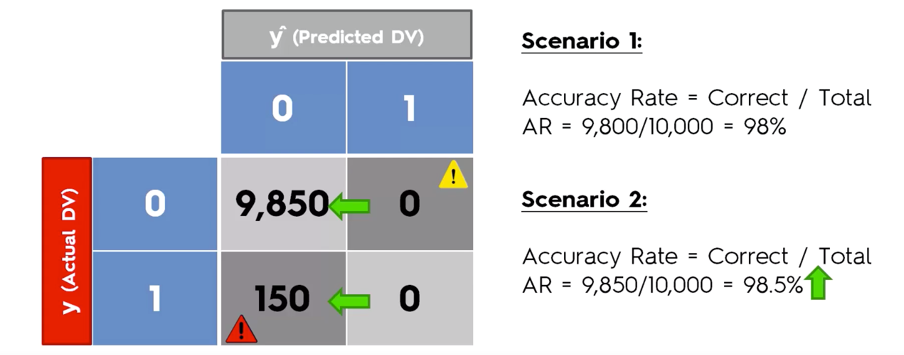

**CAP** Curve stands for Cumulative Accuracy Profile and it is more robust method for evaluating model’s performance. It compares results of the best possible model with a random prediction. Here are approximate limits for models:
60% < X < 70%  Poor
70% < X < 80%  Good
80% < X < 90%  Very Good
90%+           Too good to believe, probably overfitting

Cheat Sheet with pros and cons of classification models: [link](https://sds-platform-private.s3-us-east-2.amazonaws.com/uploads/P14-Classification-Pros-Cons.pdf)

